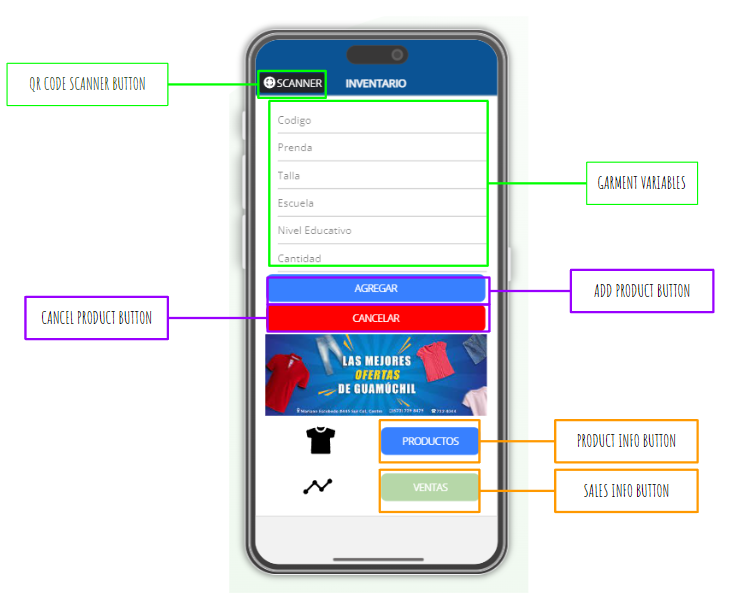

# sql_inventory_management
Inventory Management with SQL
# Overview
In this project we created a DATABASE in AWS that is connected to an appery mobile application that allows the user to input the data of the received uniform merchandise and update the information of the user inventory in real time when a client redeems a uniform voucher.
In this analysis we plan to include a bar scanner into the application, and propose a refernce code for the stores "Ofertas de Guamuchil" and "Un1tex" that references quantitative variables such as the redeemed garments, the school name or the size. That help the user to have a control of its inventory and discover sales patterns and give them a better idea of where to invest in their merchandise.
# Objectives
- [x] Generate a Free Database in AWS (RDS)
- [x] Create a connection with postgreSQL.
- [x] Generate the schema of the input inventory table
- [ ] Create the app layout with appery.io.
- [ ] Explore and define the relevant variables of each redeemed garment.
- [ ] Propose a "reference code" that allows the user have a reference of the garment characteristics.
- [ ] Create a process that reads the proposed "reference code" and store the info of the product into the input inventory table.
- [ ] Develop a process that creates/updates the table and allows the user to display garment availability in real time.
- [ ] Analyze the collected data from the uniform voucer redemption season from the stores "Ofertas de Guamuchil" and "Un1tex" and share insights with the users
# Resources
* pgAdmin PostgreSQL 12.8, AWS

## Appery.io Layout Proposal

The layout of the app consists of several key components that enable easy inventory management for "OFERTAS DE GUAMUCHIL".

### Scanner Button
At the top of the app, there is a scanner button that utilizes your cellphone camera. It allows you to capture the QR code or barcode of a product, automatically adding the product to the AWS database.

### Manual Entry Parameters
If you prefer not to use the scanner, you can manually fill in the following parameters:

1. **Codigo**: Refers to the garment code.
2. **Prenda**: Refers to the garment length.
3. **Talla**: Refers to the garment size.
4. **Escuela**: Refers to the school that offers/needs the specific garment as a student uniform.
5. **Nivel Educativo**: Refers to the school level of the uniform, which can be PRIMARIA, SECUNDARIA, or PREESCOLAR.
6. **Cantidad**: Refers to the quantity of the product to be added to the database.

### Action Buttons
There are two action buttons available:

- **AGREGAR**: Adds the information of the products to the AWS database.
- **CANCELAR**: Deletes the previously filled information in case of an error.

### Navigation Buttons
At the bottom of the layout, there are two additional buttons that link to other pages:

- **PRODUCTOS**: Takes the user to another page displaying a table with information about the available products in the inventory.
- **VENTAS**: Takes the user to another page displaying information about the products sold.

This app serves as a convenient inventory management solution for "OFERTAS DE GUAMUCHIL". With the scanner and manual entry options, along with the ability to view and manage product information and sales, it streamlines the inventory management process.
